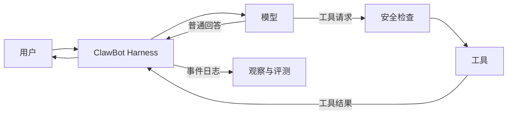

## 1. 我们到底在开发什么

ClawBot 是一个 AI Harness。Harness 可以理解为“把大语言模型可靠地运行起来的外壳”：它负责组织消息、调用模型、执行工具、保存状态、限制风险，并留下可以调试和评测的记录。

模型只负责根据上下文生成下一步；Harness 决定这一步能不能执行、怎样执行，以及何时停止。



## 2. 学习目标

完成项目后，你应该能独立解释并演示：

1. 一次模型请求由哪些消息组成。
2. Agent loop 为什么是循环，而不只是一次 API 调用。
3. 工具 schema、工具执行和工具结果怎样闭环。
4. 如何用 Fake Model 对 Harness 做确定性测试。
5. 如何限制步数、参数、目录和危险操作。
6. 如何记录一次运行，并用测试集评价改动是否退步。
7. 如何用 issue、branch、worktree、commit 和 PR 管理开发。

## 3. 每个功能都采用同一套学习循环

每一步都按以下顺序进行：

1. **先定义结果**：写一句用户故事和可验证的验收条件。
2. **画最短路径**：只确认数据从哪里来、经过哪里、到哪里去。
3. **建立 worktree**：一个功能对应一个分支和一个独立目录。
4. **先写失败检查**：用最小测试描述真正需要的行为。
5. **写最少实现**：让检查通过，不添加“以后也许会用”的结构。
6. **运行验证**：同时检查成功路径和关键失败路径。
7. **小提交**：提交信息说明产生了什么行为，而不是改了哪些文件。
8. **自审与记录**：查看 diff，把结论和下一步写进开发日志。
9. **PR 合并**：即使独立开发，也用 PR 练习面试中的团队流程。

## 4. 分阶段路线

### Phase 0：仓库与问题定义（当前阶段）

产物：

- Git 仓库和基础忽略规则
- 项目 README
- MVP 边界
- GitHub/worktree 操作手册
- 持续更新的开发日志

验收：新加入的人只看文档，就知道项目解决什么问题以及下一步做什么。

### Phase 1：可测试的最小执行链

实现：

```text
CLI 输入 -> Agent -> Fake Model -> 最终回答
```

重点学习：Python 包结构、依赖方向、消息数据结构、依赖注入的最小用途、确定性测试。

验收：不需要 API Key，执行一条命令即可得到固定答案；一条测试可以证明消息正确传给模型。

### Phase 2：接入真实模型

实现官方模型 SDK adapter，配置从环境变量读取。

重点学习：API 请求、超时、错误边界、密钥管理、Fake 与真实服务的分工。

验收：有 Key 时可以真实对话；没有 Key 时得到明确错误；测试仍然不访问网络。

### Phase 3：工具调用循环

先只加入一个无副作用工具，例如计算器或读取受限目录内的文本文件。

重点学习：tool schema、参数校验、模型请求与本地执行的边界、最大步数。

验收：模型能够请求工具，Harness 执行后把结果交回模型；超过步数会安全停止。

### Phase 4：安全与可观测性

加入结构化事件、运行 ID、耗时、错误信息和需要人工确认的危险动作。

重点学习：日志与业务输出的区别、秘密脱敏、allowlist、approval gate。

验收：一次运行可以被还原；敏感信息不会进入日志；未授权危险动作不会执行。

### Phase 5：评测与回归

建立小型 JSON 测试集，运行离线评测并输出通过率和失败案例。

重点学习：确定性断言与模型质量评测的区别、基线、回归、成本和延迟。

验收：修改 prompt 或工具后，可以用一条命令比较结果，而不是只凭感觉。

### Phase 6：面试展示

整理架构图、关键权衡、故障案例、演示脚本和简历描述。

验收：可以在 5 分钟内演示，在 15 分钟内讲清设计，在追问中指出当前上限和下一步扩展方式。

## 5. 当前明确不做

- Web UI：CLI 足以验证 Harness 核心。
- 数据库：在需要持久会话或多人使用前，文件和内存足够。
- RAG：它是检索能力，不是最小 Agent loop 的前置条件。
- 多 Agent：单 Agent 的状态、安全和评测没做好前，多 Agent 只会放大问题。
- 自制通用框架：ClawBot 是一个可解释的产品，不是为了猜测未来需求的平台。

## 6. 下一步

从 `main` 创建 `feat/minimal-loop` worktree，在其中完成 Phase 1。开始前先阅读 [Git、GitHub 与 worktree](01-git-github-worktree.md)。
